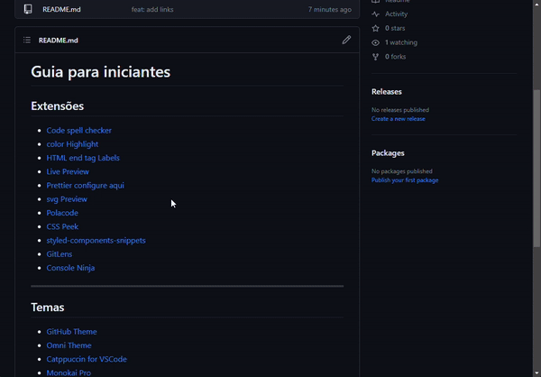

```JSON
    "editor.formatOnSave": true,
    "editor.linkedEditing": true,
    "[css]": {
        "editor.defaultFormatter": "esbenp.prettier-vscode"
    },
    "[html]": {
        "editor.defaultFormatter": "esbenp.prettier-vscode"
    },
    "[javascript]": {
        "editor.defaultFormatter": "esbenp.prettier-vscode"
    },
    "prettier.semi": false,
    "editor.tabSize": 2,
```


